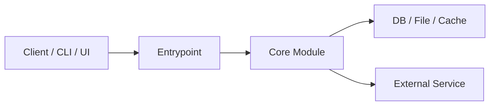

# Architecture Diagram Template

Write `doc/architecture-diagram.md` as a short explanation plus one Mermaid block diagram.

## Required structure

## 1. 图示说明

- 说明该图描述的是运行时架构、部署关系，还是模块协作关系
- 说明图中省略了哪些次要细节
- 标注 `事实` 与 `推断` 边界，必要时写出待确认项

## 2. Mermaid 图

- 使用 `flowchart LR` 或 `flowchart TD`
- 节点数量控制在 6 到 14 个之间，避免过度细碎
- 节点名称应与仓库中的真实模块、服务、目录或组件相对应
- 连线要表达明确关系，例如调用、依赖、读写、消息传递、构建产出

## 3. 图后解读

- 用 3 到 6 个要点解释关键链路
- 说明最核心的入口、中心模块、状态存储和外部集成
- 如果是 monorepo，解释 package 或 service 之间的主依赖方向

## Writing guidance

- 框图用于帮助快速理解主结构，不追求穷尽所有模块。
- 如果仓库更适合“模块关系图”而不是“部署图”，就按实际情况选择，但要在说明里写清楚。
- 不要为了美观编造中间层；每个节点都应能在仓库中找到对应证据。
